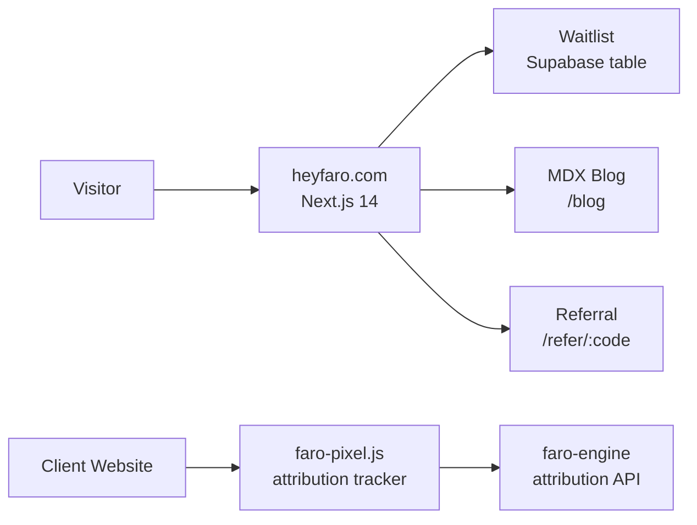

# faro-landing

The Faro marketing site — a bilingual (English/Spanish) Next.js 14 App Router site at [heyfaro.com](https://heyfaro.com). It handles the waitlist, referral program, blog, FAQ, and privacy pages. It also ships the `faro-pixel` attribution tracker as a built package that client websites embed to measure AI-driven traffic.



*Written description: Visitors land on heyfaro.com, join the waitlist stored in Supabase, share referral links, and read the blog. Separately, each client's website embeds the faro-pixel script which fires attribution events back to faro-engine when visitors arrive from AI-generated answers.*

## Quick start

**Prerequisites:** Node 20+, npm. No backend needed for the marketing site itself.

```bash
git clone https://github.com/rebeccacamejo/faro-landing
cd faro-landing

npm install

# Copy and fill env vars
cp .env.local.example .env.local
# Required: NEXT_PUBLIC_SUPABASE_URL, NEXT_PUBLIC_SUPABASE_ANON_KEY

npm run dev
```

Site runs at `http://localhost:3000`. Toggle locale at `/en` vs `/es`.

## Key env vars

| Variable | Purpose |
|---|---|
| `NEXT_PUBLIC_SUPABASE_URL` | Supabase project URL |
| `NEXT_PUBLIC_SUPABASE_ANON_KEY` | Public anon key for waitlist writes |
| `SUPABASE_SERVICE_ROLE_KEY` | Used server-side for admin waitlist table |
| `RESEND_API_KEY` | Confirmation email on waitlist signup |

## faro-pixel package

The attribution tracker lives in `packages/faro-pixel/`. It's a tiny vanilla-JS script that fires a `pageview` event to faro-engine when a page loads with `?ref=ai` or known AI referrer headers.

```bash
# Build the pixel (outputs to packages/faro-pixel/dist/ and public/pixel.js)
npm run icons  # regenerates SVG icons
cd packages/faro-pixel && node build.mjs
```

## Docs

| Document | Contents |
|---|---|
| [Getting started](docs/getting-started.md) | Full setup, i18n, Supabase config |
| [Architecture](docs/architecture.md) | App Router structure, i18n routing, pixel tracker |
| [Deployment](docs/deployment.md) | Vercel deploy, env vars, DNS |
| [Testing](docs/testing.md) | Vitest for pixel, Next.js linting |
| [Conventions](docs/conventions.md) | Code style, commit format, PR process |

---

*Owner: Rebecca · Last reviewed: 2026-05-10 · Questions? Open an issue or ask in #engineering*
