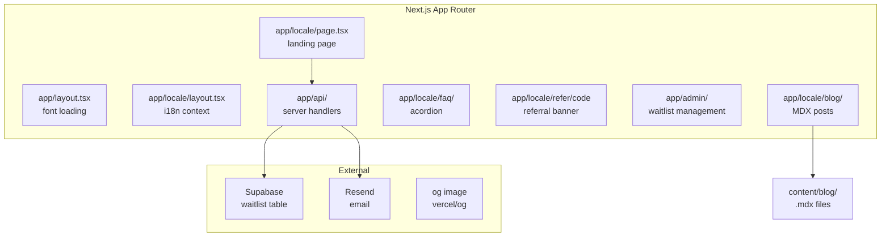
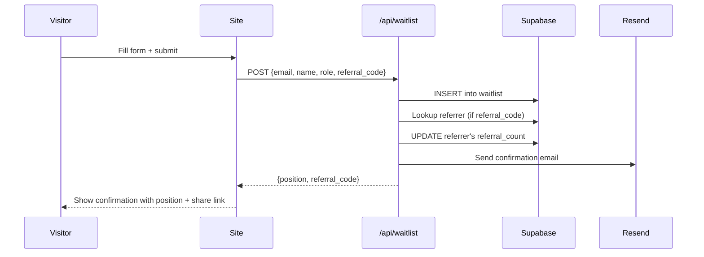

# Architecture — faro-landing

## App structure



*Written description: The marketing site is a statically-rendered Next.js app with internationalized routing. All pages live under the locale segment. The blog pulls from MDX files at build time. The waitlist form calls a server-side route handler that writes to Supabase and sends a confirmation via Resend.*

## i18n routing

Built with `next-intl`. Locale is the first segment of the URL path:

```
heyfaro.com/en/blog     → English blog
heyfaro.com/es/blog     → Spanish blog
heyfaro.com/            → Auto-redirects based on Accept-Language header
```

`i18n/routing.ts` defines supported locales (`en`, `es`) and the default (`en`). `middleware.ts` handles the redirect. Translation strings are in `messages/en.json` and `messages/es.json`.

## faro-pixel attribution tracker

Lives in `packages/faro-pixel/` as a separate package.

**What it does:** Detects when a visitor arrives from an AI-generated answer and fires a pageview event to faro-engine. Detection criteria:
- Referrer URL matches known AI domains (perplexity.ai, chat.openai.com, claude.ai, gemini.google.com)
- URL has `?ref=ai` or `?utm_source=ai` query params
- `X-AI-Referrer` header (set by some AI-powered browsers)

**How it's served:** Built to `public/pixel.js`, served as a static file from heyfaro.com. Clients embed it:
```html
<script src="https://heyfaro.com/pixel.js" data-client="accounting-to-scale" async></script>
```

**Build:**
```bash
cd packages/faro-pixel && node build.mjs
```
Outputs to `dist/pixel.esm.js` (ESM) and `dist/pixel.js` (IIFE for CDN use). Also copies to `public/pixel.js`.

## Waitlist flow



## Admin area

`app/admin/` — password-protected (uses Supabase auth, same project). Shows the full waitlist with sorting and export. Access requires `profiles.role = 'admin'` — same as faro-ops.

## Design decisions

### Why next-intl over next-i18next

`next-intl` is built for App Router. `next-i18next` was built for Pages Router and requires workarounds for SSR in App Router. `next-intl` provides server-side translation resolution with zero config.

### Why MDX files over a CMS

The blog content is technical and written by Rebecca. A CMS adds operational overhead (auth, backups, publishing workflow) for one author. MDX files in git give version history, local editing, and zero subscription cost.

---

*Owner: Rebecca · Last reviewed: 2026-05-10 · Questions? Open an issue or ask in #engineering*
